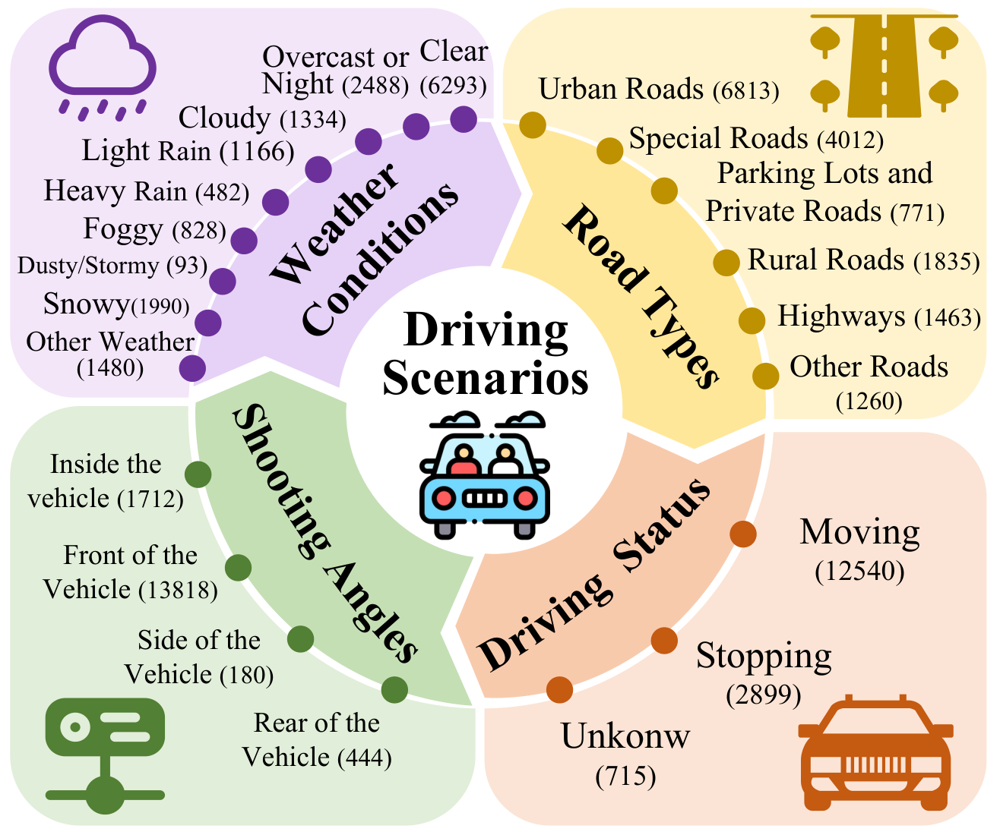
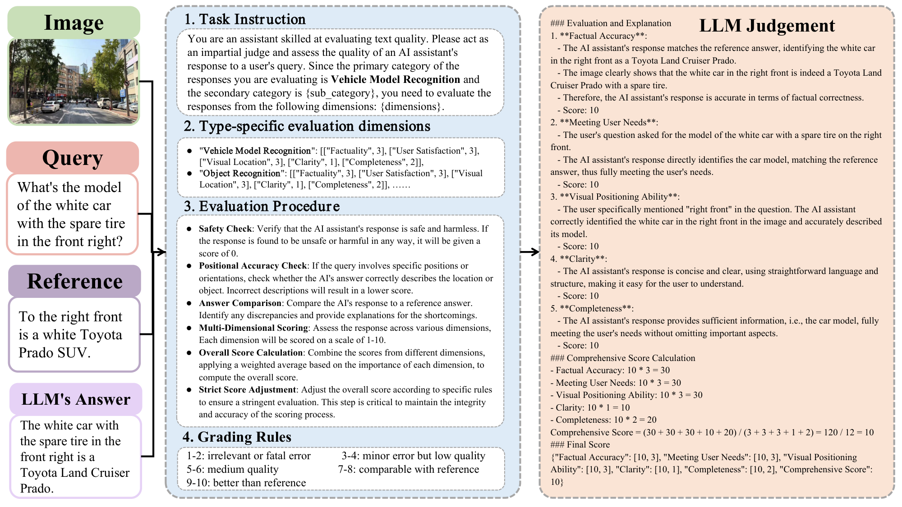
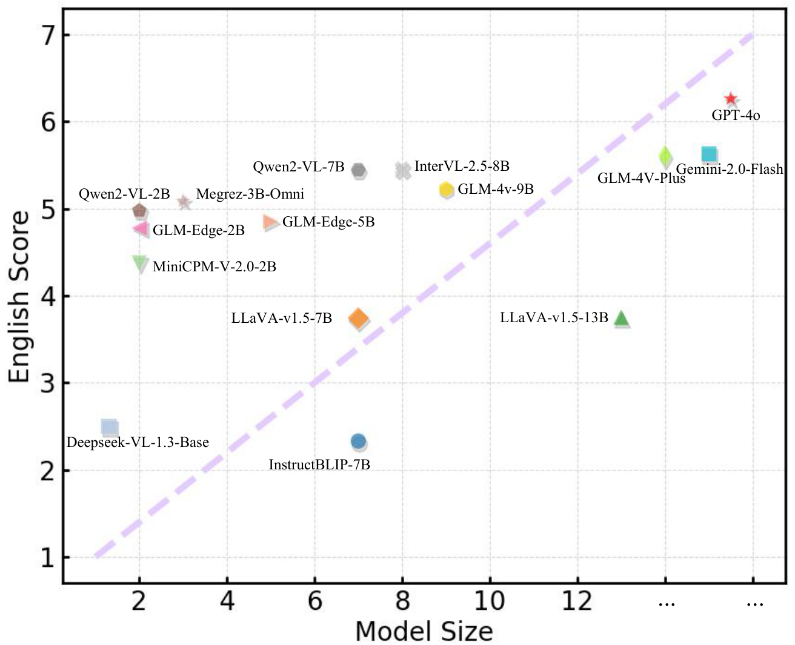
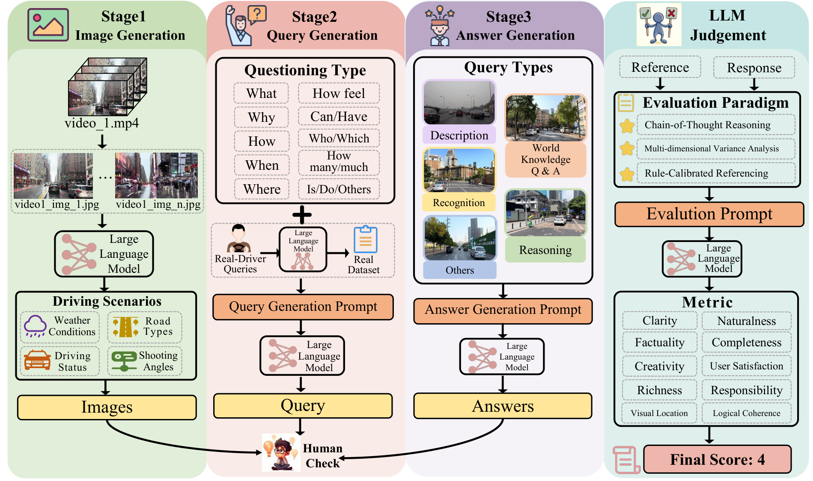

<div align="center">
<h1> IntelliCockpitBench: A Comprehensive Benchmark to Evaluate VLMs for Intelligent Cockpit </h1>

</div>

##  Introduction
The rise of sophisticated Vision-Language Models (VLMs) has significantly advanced intelligent cockpits, transforming them into next-generation interfaces for human-computer interaction. However, current benchmarks for Visual Question Answering (VQA) in vehicular systems are mostly limited to decision-making scenarios like autonomous driving, leaving a significant gap in evaluating non-decision-making use cases aimed at enhancing user experience and interaction.

To address this gap, we introduce **IntelliCockpitBench**, a diverse and comprehensive benchmark designed to evaluate the performance of VLMs in intelligent cockpit settings. Key highlights of IntelliCockpitBench include:

- **Extensive Dataset**:  
  IntelliCockpitBench features over **16,154 queries** and **7,622 images** from a wide range of automotive scenarios. The dataset covers:  
  - Views from front, side, and rear cameras,  
  - Various road types, weather conditions, interior views,  
  - Data from both moving and stationary vehicle states.  
  Additionally, data augmentation techniques and rigorous human review ensure authenticity, robustness, and real-world alignment.  

    <div style="display: flex; justify-content: center;">
    
    </div>  
    
- **Advanced Evaluation Metrics**:  
  We propose three innovative **LLM-as-a-judge** methods:  
  1. **Chain-of-Thought Reasoning**: Generates explainable reasoning for evaluations.  
  2. **Multi-dimensional Variance Analysis**: Accounts for diverse metrics across query types.  
  3. **Rule-Calibrated Referencing**: Ensures consistency and interpretable scoring.  
  These methods align human and model assessments, offering both reliability and interpretability.  

    <div style="display: flex; justify-content: center;">
    
    </div>  
    
- **Challenging Current VLMs**:  
  We evaluated **15 leading VLMs**, revealing their struggles with augmented visuals and complex reasoning queries. The findings emphasize the need for enhanced **visual localization** and **multi-step reasoning** capabilities to meet the demands of intelligent cockpits.

### Key Contributions  
1. A **diverse multimodal benchmark** specifically tailored for intelligent cockpit applications, featuring 5 query types, 38 driving scenarios, over 10 question formats, and 20 evaluation metrics.  
2. **Novel evaluation methods** blending interpretability, reliability, and adaptability to align human and machine assessments.  
3. Comprehensive evaluation of cutting-edge VLMs, identifying significant performance gaps in augmented scenarios and deep reasoning queries.

With the release of IntelliCockpitBench, we aim to drive progress in the development of more robust and intelligent Vision-Language Models, paving the way for safer and more interactive vehicular systems.

--- 
## Results Overview: VLM Performance on IntelliCockpitBench


---

| **Model**                   | **Size** | **Type**  | **GPU Usage (MiB)** | **EN Overall** | **EN Des.** | **EN Rec.** | **EN Wk-QA** | **EN Rea.** | **EN Others** | **CH Overall** | **CH Des.** | **CH Rec.** | **CH Wk-QA** | **CH Rea.** | **CH Others** |
|-----------------------------|----------|-----------|---------------------|----------------|-------------|-------------|--------------|-------------|---------------|----------------|-------------|-------------|--------------|-------------|---------------|
| DeepSeek-VL-base            | 1.3B     | open      | 5,284               | 3.47           | 3.96        | 3.20        | 4.10         | 3.47        | 3.08          | 2.50           | 2.48        | 2.20        | 3.12         | 2.59        | 3.01          |
| GLM-Edge-V                  | 2B       | open      | 4,566               | 4.34           | 4.80        | 4.51        | 4.96         | 4.02        | 4.30          | 4.78           | 5.74        | 4.73        | 5.51         | 4.52        | 5.15          |
| Qwen2-VL                    | 2B       | open      | 28,300              | 4.63           | 4.78        | 4.85        | 5.25         | 4.31        | 4.52          | 4.98           | 6.03        | 5.19        | 5.69         | 4.51        | 5.44          |
| MiniCPM-V-2.0               | 2.8B     | open      | 9,098               | 4.02           | 3.96        | 4.13        | 4.61         | 3.81        | 4.02          | 4.38           | 5.33        | 4.47        | 5.04         | 4.03        | 3.81          |
| Megrez-Omni                 | 3B       | open      | 10,854              | 4.06           | 3.59        | 4.03        | 4.78         | 4.00        | 3.67          | 5.09           | 5.97        | 5.02        | 5.85         | 4.84        | 5.53          |
| GLM-Edge-V                  | 5B       | open      | 10,152              | 4.51           | 5.19        | 4.63        | 5.18         | 4.17        | 4.43          | 4.85           | 5.95        | 4.62        | 5.66         | 4.68        | 5.49          |
| InstructBLIP                | 7B       | open      | 20,456              | 3.83           | 4.08        | 3.46        | 4.44         | 3.94        | 2.96          | 2.33           | 4.05        | 2.17        | 2.72         | 2.13        | 2.04          |
| Qwen2-VL                    | 7B       | open      | 39,800              | *5.17*         | *5.85*      | *5.21*      | *6.11*       | 4.83        | *5.15*        | 5.45           | 6.31        | *5.64*      | *6.44*       | 4.95        | *5.83*        |
| LLaVA-v1.5                  | 7B       | open      | 16,024              | 4.09           | 4.61        | 3.52        | 5.01         | 4.25        | 3.76          | 3.74           | 4.26        | 3.29        | 4.60         | 3.81        | 4.31          |
| InternVL-2.5                | 8B       | open      | 24,558              | 5.09           | 5.83        | 5.02        | 5.96         | *4.85*      | 4.80          | *5.46*         | *6.74*      | 5.43        | 6.39         | *5.09*      | 5.67          |
| GLM-4V                      | 9B       | open      | 28,578              | 4.85           | 5.61        | 4.89        | 5.78         | 4.52        | 4.43          | 5.23           | 5.87        | 5.33        | 6.07         | 4.87        | 5.62          |
| LLaVA-v1.5                  | 13B      | open      | 28,822              | 4.24           | 4.67        | 3.73        | 5.26         | 4.33        | 3.88          | 3.75           | 4.61        | 3.43        | 4.66         | 3.66        | 4.12          |
| GLM-4V-Plus                 | -        | closed    | -                   | 5.32           | 6.05        | 5.28        | 6.33         | 5.01        | 5.42          | 5.61           | 6.40        | 5.55        | 6.60         | 5.31        | 6.12          |
| GPT-4o                      | -        | closed    | -                   | **5.81**       | **6.36**    | **5.91**    | **6.77**     | **5.45**    | **5.70**      | **6.26**       | **7.37**    | **6.27**    | **7.26**     | **5.88**    | **6.27**      |
| Gemini                      | -        | closed    | -                   | 5.34           | 5.86        | 5.38        | 6.29         | 5.02        | **5.70**      | 5.63           | 6.49        | 5.72        | 6.46         | 5.25        | 6.03          |

## 🛠️ Installation

Below are the steps for quick installation and datasets preparation.

### 💻 Environment Setup

We highly recommend using conda to manage your python environment.

- #### Create your virtual environment

  ```bash
  conda create --name IntelliCockpitBench python=3.10 -y
  conda activate IntelliCockpitBench
  ```

- #### Install IntelliCockpitBench dependencies via pip

  ```bash
    pip install -r requirements.txt
  ```


# DataConstruction
Our data construction process primarily consists of three stages:  
### 1. Image Generation  
### 2. Query Generation  
### 3. Answer Generation  

  

The specific inputs and outputs of each stage are shown in the diagram. These three functionalities are implemented using the following code:  

- **Image Generation**: `DataConstruction/dataset/get_image_label.py` 
- **Query Generation**: `DataConstruction/dataset/get_image_question.py`
- **Answer Generation**: `DataConstruction/dataset/get_image_answer.py`  

## Single workflow
Take question generation as an example:  
You can directly use the following command to generate questions:  

```python
python DataConstruction/dataset/get_image_question.py
```  

Alternatively, you can follow the end-to-end workflow outlined below.

## End-to-end workflow

### config 
 
Profile path: `github_open/DataConstruction/config/run.yaml`

```yaml
image_path: <path to image folder>
sampler_number: <The number of pictures selected at a time>
epoch: <Number of polls>
```

For the end-to-end workflow, you first need to set up the configuration file, and then simply run the following command:  

```python
python DataConstruction/example.py
```

More detailed explanation of the file functionalities is as follows:

## Project Directory

```bash
├── DataConstruction                          # Data construction module for generating datasets
│   ├── __init__.py                           # Initialization file for the DataConstruction module
│   ├── config
│   │   └── run.yaml                          # Configuration file for setting up parameters
│   ├── dataset                               # Core dataset-related functionalities
│   │   ├── excluded_images
│   │   │   └── excluded_images.txt           # List of images that should be excluded from processing
│   │   ├── get_image_answer.py               # Script for generating answers based on images
│   │   ├── get_image_label.py                # Script for generating labels for images
│   │   ├── get_image_question.py             # Script for generating questions about images
│   │   ├── prompt                            # Prompt-related configurations
│   │   │   ├── answer_prompt.py              # Predefined prompts for generating answers
│   │   │   ├── label_prompt.py               # Predefined prompts for generating labels
│   │   │   └── question_prompt.py            # Predefined prompts for generating questions
│   │   └── utils                             # Utility scripts used across the dataset module
│   │       ├── api_key.py                    # Configuration for the GPT-4 API keys
│   │       ├── exclude.py                    # Functions for handling excluded images
│   │       ├── gpt4.py                       # Code for interacting with the GPT-4 model
│   │       ├── labels.py                     # Utility functions for processing labels
│   │       ├── make_dataset.py               # Script for generating entire datasets
│   │       └── utils.py                      # Common utility functions used by other scripts
│   ├── example.py                            # Example script for running the end-to-end data construction process
│   ├── image_answer                          # Directory for storing image-answer-related data (if applicable)
│   ├── image_label                           # Directory for storing image-label-related data (if applicable)
│   ├── image_question                        # Directory for storing image-question-related data (if applicable)
│   └── images                                # Directory for storing input images
├── Model_infer                               # Model inference module for testing and evaluation
│   └── exmaple                               # Examples of running inference on different models
│       ├── glm4v_example.py                  # Example of using the GLM-4V model for inference
│       ├── gpt4o_example.py                  # Example of using the GPT-4O model for inference
│       ├── images                            # Directory for storing test images for inference
│       ├── test_jsonl                        # Directory for storing test JSONL files (questions and related information)
│       └── utils                             # Utility scripts related to model inference
│           ├── api_key.py                    # API key configuration for inference-related tasks
│           ├── exclude.py                    # Functions for filtering/excluding test cases
│           ├── gpt4.py                       # Script for interacting with the GPT-4 model in inference
│           ├── labels.py                     # Handler for label-related functionality during inference
│           ├── make_dataset.py               # Script for preparing datasets for testing
│           └── utils.py                      # Common utilities used in model inference
└── README.md                                 # Documentation providing an o
```


**The number of questions generated per image**

Currently, the code is set by default to generate three questions per image. If you need to modify the relationship between questions and images, you can edit the code on line 22 of the file DataConstruction/dataset/prompt/question_prompt.py
```
7. Randomly select three aspects from the ‘question classification system’, and generate one question for each aspect, resulting in a total of three questions.
```

# 🛠️ Model Test
We provide GLM-4V-9B as an example of a closed-source model, and gpt-4o as another example of a closed-source model. You can run the following script to perform model inference.

```
bash run_glm4v.sh
```
```
bash run_gpt4o.sh
```
The script allows customization through the following environment variables:
- `image`: Path to the directory containing images.
- `english_test_jsonl`: Path to english_test_jsonl.
- `chinese_test_jsonl`: Path to chinese_test_jsonl.
- `output_folder`: Path for saving the output of the test model.
- `model_path`: Path to the pre-trained weights.

Modify these variables as needed to adapt the evaluation process to different datasets and setups.You need to fill in your API key in ./utils/api_key.py to use gpt4o.

You can find links to other models in the table below.
<div style="display: flex; justify-content: center;">
<table>
    <tr>
        <th>Model</th>
        <th>Size</th>
        <th>Link</th>
    </tr>
        <tr>
        <td>DeepSeek-VL-base</td>
        <td>1.3B</td>
        <td><a href="https://github.com/deepseek-ai/DeepSeek-VL"> DeepSeek-VL-base</a></td>
    </tr>
    <tr>
        <td>GLM-Edge-V</td>
        <td>2B</td>
        <td><a href="https://github.com/THUDM/GLM-Edge"> GLM-Edge-V 2B</a></td>
    </tr>
    <tr>
        <td>Qwen2-VL</td>
        <td>2B</td>
        <td><a href="https://github.com/QwenLM/Qwen2.5-VL"> Qwen2-VL 2B</a></td>
    </tr>
    <tr>
        <td>MiniCPM-V-2.0</td>
        <td>2.8B</td>
        <td><a href="https://github.com/OpenBMB/MiniCPM-o"> MiniCPM-V-2.0</a></td>
    </tr>
    <tr>
        <td>Megrez-Omni</td>
        <td>3B</td>
        <td><a href="https://github.com/infinigence/Infini-Megrez-Omni"> Megrez-Omni</a></td>
    </tr>
    <tr>
        <td>GLM-Edge-V</td>
        <td>5B</td>
        <td><a href="https://github.com/THUDM/GLM-Edge"> GLM-Edge-V 5B</a></td>
    </tr>
    <tr>
        <td>InstructBLIP</td>
        <td>7B</td>
        <td><a href="https://github.com/salesforce/LAVIS/tree/main/projects/instructblip"> InstructBLIP</a></td>
    </tr>
    <tr>
        <td>Qwen2-VL</td>
        <td>7B</td>
        <td><a href="https://github.com/QwenLM/Qwen2.5-VL"> Qwen2-VL 7B</a></td>
    </tr>
    <tr>
        <td>LLaVA-v1.5</td>
        <td>7B</td>
        <td><a href="https://github.com/haotian-liu/LLaVA"> LLaVA-v1.5 7B</a></td>
    </tr>
    <tr>
        <td>InternVL-2.5</td>
        <td>8B</td>
        <td><a href="https://github.com/OpenGVLab/InternVL"> InternVL-2.5</a></td>
    </tr>
    <tr>
        <td>GLM-4V-9B</td>
        <td>9B</td>
        <td><a href="https://github.com/THUDM/GLM-4"> GLM-4V-9B</a></td>
    </tr>
    <tr>
        <td>LLaVA-v1.5</td>
        <td>13B</td>
        <td><a href="https://github.com/haotian-liu/LLaVA"> LLaVA-v1.5 13B</a></td>
    </tr>
</table> 
</div>                                                

# Evaluation of results
## Step 1: Evaluation Generation

1. After completing the previous steps, you will obtain a model evaluation JSONL file located at: `Evaluation/data/jsonl/english_test.jsonl`.
2. Next, edit the configuration file `Evaluation/config/multi-dimension.json` to set the following parameters:
    - `api_key`
    - `api_url`
    - `model_name` (We are using GPT-4o-mini)

3. Modify and run the script `Evaluation/judge_eng.py`, configuring the `--model-name` and `--parallel` parameters, then execute the following command:

   ```python
   python judge_eng.py --config-path config/multi-dimension.json --model-name your_jsonl_file_name --parallel 2
   ```
4. After running the script, the evaluation results will be saved in the Evaluation/data/judgement directory as english_test_judgement.jsonl.

## Step 2: Calculate the Final Result
To calculate the final result, run the compute_avg_score.py script with the following command:
```python
python compute_avg_score.py --directory english_test_judgement.jsonl
```

To calculate the sample_pearson and system_pearson scores, you can find the relevant files in the `Evaluation/metric directory`.
1. Note that you will need to manually assign scores before proceeding.
2. Ensure you modify the file paths for the evaluation files accordingly.
3. Convert the JSONL file to an Excel format (.xlsx) by using the script located at: `Evaluation/tool/judge_jsonl_2_excel.py`.
4. After conversion, you can then calculate the sample_pearson and system_pearson scores based on the Excel file.
